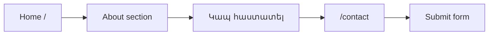
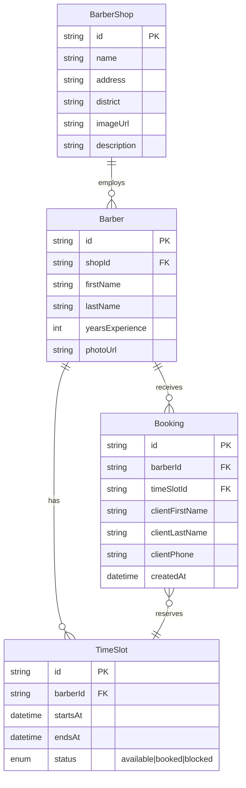

# Barber Shop — էջերի և ֆունկցիոնալի տեխզադրանք

> **Նախագիծ.** Barber Shop վեբ-կայք (ամրագրում + showcase)  
> **Վերջին թարմացում.** 2026-06-30  
> **Կարգավիճակ.** Draft — զարգացման spec

---

## 1. Նկարագրություն

Barber Shop-ի պրոմո և ամրագրման կայք։ Օգտատերը կարող է դիտել salon-ները, ընտրել barber shop, տեսնել barber-ներին և ամրագրել ազատ ժամը։

**Հիմնական էջեր.**

| Route | Նշանակություն |
|-------|----------------|
| `/` | Գլխավոր (Home) |
| `/products` | Shop / Barber shop-երի ցուցակ + ֆիլտրեր |
| `/products/[shopId]` | Մեկ barber shop-ի էջ (barber-ների ցուցակ) |
| `/contact` | Կապ հաստատել (Home-ի «Կապ» կոճակից) |

---

## 2. Գլխավոր էջ (`/`)

### 2.1 Hero բաժին (վերև)

| Պահանջ | Նկարագրություն |
|--------|----------------|
| Տեսողական | Մեծ, գրավիչ hero նկար (barber / salon թեմatik) |
| CTA | «Գնալ խանութ» / «Shop» կոճակ → տանում է `/products` |
| Layout | Full-width hero, responsive (mobile / tablet / desktop) |

**Acceptance criteria**
- Hero-ն առաջին viewport-ում է տեսանելի
- CTA-ն մեկ click-ով տանում է `/products`

---

### 2.2 Barber shop gallery (Hero-ի տակ)

| Պահանջ | Նկարագրություն |
|--------|----------------|
| Քարտեր | Փոքր barber shop նկարներ (grid / carousel) |
| Յուրաքանչյուր քարտ | Նկար + կարճ նկարագրություն (salon-ի անուն, հասցե կամ ծառայություն) |
| Click | Ցանկության դեպքում → `/products/[shopId]` (optional v1) |

**Acceptance criteria**
- Gallery-ն responsive grid է (օր. 1 / 2 / 3 սյունակ)
- Նկարագրությունը կարդացվող է նկարի վրա կամ ներքև

---

### 2.3 «Մեր մասին» բաժին

| Պահանջ | Նկարագրություն |
|--------|----------------|
| Բովանդակություն | 2–4 абзац / bullet — salon-ի պատմություն, արժեքներ, փորձ |
| CTA | «Կապ հաստատել» կոճակ → `/contact` |
| Layout | Տեքստ + optional side image |

**Acceptance criteria**
- Բաժինը Home-ում Hero-ից և gallery-ից հետո է
- Կապի կոճակը հաս reachable է keyboard-ով

---

### 2.4 Footer

| Պահանջ | Նկարագրություն |
|--------|----------------|
| Բովանդակություն | Logo / անուն, հասցե, հեռախոս, email, social links |
| Navigation | Home, Products, Contact |
| Copyright | © տարի + salon անուն |

---

## 3. Shop էջ (`/products`)

### 3.1 Ֆիլտրեր (վերև)

| Ֆիլտր | Տեսակ | Նկարագրություն |
|-------|--------|----------------|
| Ոլորտ / թաղամաս | Select | Ֆիլտրել shop-երը location-ով |
| Ծառայություն | Multi-select | Սանրվածք, մորուք, combo և այլն |
| Որոնում | Text | Shop անունով / հասցեով |

> **v1 default:** location + service type + search. Լրացուցիչ ֆիլտրեր (գին, rating) — Phase 2.

**Acceptance criteria**
- Ֆիլտրերը URL query params-ով են (օր. `?district=...&service=...`) — shareable link
- Ֆիլտրի փոփոխությունից shop-երի ցուցակը թարմանում է առանց full page reload (client-side կամ server re-fetch)

---

### 3.2 Barber shop-երի ցուցակ

| Պահանջ | Նկարագրություն |
|--------|----------------|
| Քարտ | Shop-ի նկար, անուն, կարճ info (հասցե / rating) |
| Click | Տանում է `/products/[shopId]` |
| Empty state | «Չի գտնվել» + reset filters |

**Acceptance criteria**
- Grid responsive
- Lazy-load նկարներ
- Keyboard accessible cards (focus + Enter)

---

## 4. Shop single page (`/products/[shopId]`)

### 4.1 Shop header

| Պահանջ | Նկարագրություն |
|--------|----------------|
| Hero / cover | Barber shop-ի մեծ նկար |
| Info | Salon անուն, հասցե, աշխատանքային ժամեր (optional) |

---

### 4.2 Barber-ների ցուցակ

| Պահանջ | Նկարագրություն |
|--------|----------------|
| Քարտ / row | Barber-ի նկար, **անուն**, **ազգանուն**, **տարվա փորձ** |
| Click | Բացում է ամրագրման modal (տես §5) |
| Hover | Visual feedback (cursor, subtle shadow) |

**Acceptance criteria**
- Յուրաքանչյուր barber-ի card clickable է
- Փորձը ցուցադրվում է «X տարի փորձ» format-ով

---

## 5. Ամրագրման modal (barber click)

### 5.1 Վարք և layout

| Պահանջ | Նկարագրություն |
|--------|----------------|
| Բացում | **Աջից** slide-in panel / drawer |
| Չափ | Լրիվ էջի բարձրություն, լայնություն ~400–480px (desktop); mobile-ում full-screen |
| Overlay | Մնացած էջը մթնեցված backdrop-ով «փակված» է |
| Փակում | X, Escape, backdrop click |

```
┌──────────────────────────────┬─────────────┐
│                              │   MODAL     │
│   Page (dimmed)              │  Booking    │
│                              │  Panel →    │
└──────────────────────────────┴─────────────┘
```

---

### 5.2 Modal բովանդակություն

#### A. Barber info (վերև)
- Barber-ի նկար, անուն, ազգանուն
- Shop անուն (context)

#### B. Ազատ ժամեր
- Օրերի ընտրություն (date picker կամ horizontal day tabs)
- Time slot grid — միայն **ազատ** ժամերը selectable
- Զբաղված ժամերը disabled / hidden

#### C. Ամրագրման ձև
| Դաշտ | Պարտադիր | Validation |
|------|-----------|------------|
| Անուն | ✅ | min 2 chars |
| Ազգանուն | ✅ | min 2 chars |
| Հեռախոսահամար | ✅ | AM format (+374...) |

#### D. Submit
- «Ամրագրել» կոճակ — active միայն երբ ընտրված է time slot + լրացված են դաշտերը
- Success → confirmation message + modal close
- Error → inline error (slot taken, network)

**Acceptance criteria**
- Double-submit protection (loading state)
- Slot conflict → user-friendly error
- Form validation client + server

---

## 6. Կապ (`/contact`)

| Պահանջ | Նկարագրություն |
|--------|----------------|
| Դաշտեր | Անուն, Email / Phone, Հաղորդագրություն |
| Submit | «Ուղարկել» → email (Resend) կամ store in DB |
| Info | Salon հասցե, map link (optional), social |

---

## 7. Օգտատիրոջ հոսքեր (User flows)

### Flow 1 — Home → Shop → Book

```mermaid
flowchart LR
  Home["Home /"] --> HeroCTA["Hero CTA"]
  HeroCTA --> Products["/products"]
  Products --> Filter["Apply filters"]
  Filter --> ShopCard["Click shop card"]
  ShopCard --> ShopPage["/products/shopId"]
  ShopPage --> BarberClick["Click barber"]
  BarberClick --> Modal["Booking modal"]
  Modal --> SelectSlot["Select time slot"]
  SelectSlot --> FillForm["Name + Phone"]
  FillForm --> Submit["Ամրագրել"]
  Submit --> Success["Confirmation"]
```



### Flow 2 — Home → Contact



---

## 8. Տվյալների մոդել (ս черновик)



---

## 9. API endpoints (ս черновик)

| Method | Route | Նշանակություն |
|--------|-------|----------------|
| GET | `/api/shops` | Shop-երի ցուցակ (+ query filters) |
| GET | `/api/shops/[id]` | Shop + barbers |
| GET | `/api/barbers/[id]/slots?date=YYYY-MM-DD` | Ազատ ժամեր |
| POST | `/api/bookings` | Նոր ամրագրում |
| POST | `/api/contact` | Կապի form |

---

## 10. UI / UX ուղեցույց

| Թեմա | Որոշում |
|------|---------|
| Լեզու UI | Հայերեն (hy) — v1 |
| Styling | Tailwind CSS, no inline styles |
| Modal animation | Slide-in from right, 200–300ms ease |
| Images | R2 / CDN, WebP, alt text |
| Responsive | Mobile-first |

---

## 11. Phase breakdown

### Phase 1 — MVP (frontend + mock/static data)
- [ ] Home (hero, gallery, about, footer)
- [ ] `/products` static list + filters UI
- [ ] Shop single page + booking modal UI
- [ ] Contact page UI

### Phase 2 — Backend
- [ ] Prisma schema + migrations
- [ ] Shops / barbers / slots / bookings API
- [ ] Admin slot management (manual or calendar)

### Phase 3 — Polish
- [ ] Email confirmation (Resend)
- [ ] SMS reminder (optional)
- [ ] Admin panel

---

## 12. Բաց հարցեր (TBD)

| # | Հարց | Default v1 |
|---|------|------------|
| 1 | Gallery card click → shop page? | Այո |
| 2 | Admin panel կա՞ | Ոչ — Phase 3 |
| 3 | Auth (login) barber/admin-ի համար | Phase 3 |
| 4 | Վճարում online | Ոչ — v1 միայն ամրագրում |
| 5 | i18n (en/hy) | hy only v1 |

---

## 13. Կապված փաստաթղթեր

- [`docs/BRIEF.md`](./BRIEF.md) — նախագծի brief
- [`docs/TECH_CARD.md`](./TECH_CARD.md) — stack (ստեղծել onboarding-ից հետո)
- [`docs/01-ARCHITECTURE.md`](./01-ARCHITECTURE.md) — ճարտարապետություն

---

**Փաստաթղթի տարբերակ.** 1.0  
**Ամսաթիվ.** 2026-06-30
